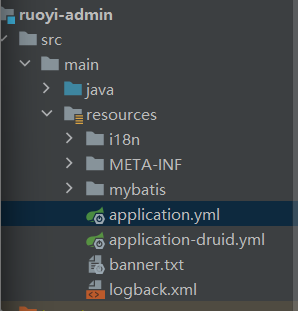
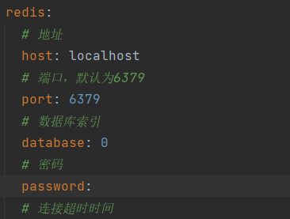
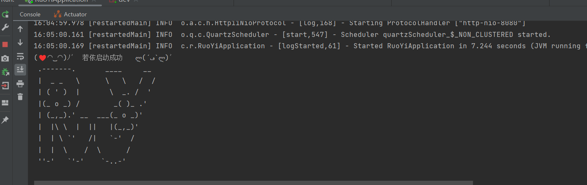
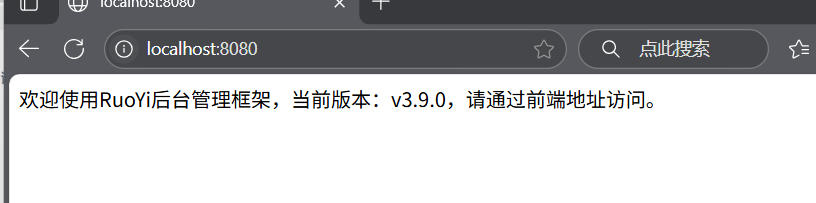
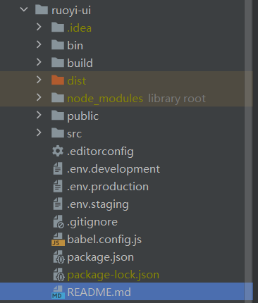
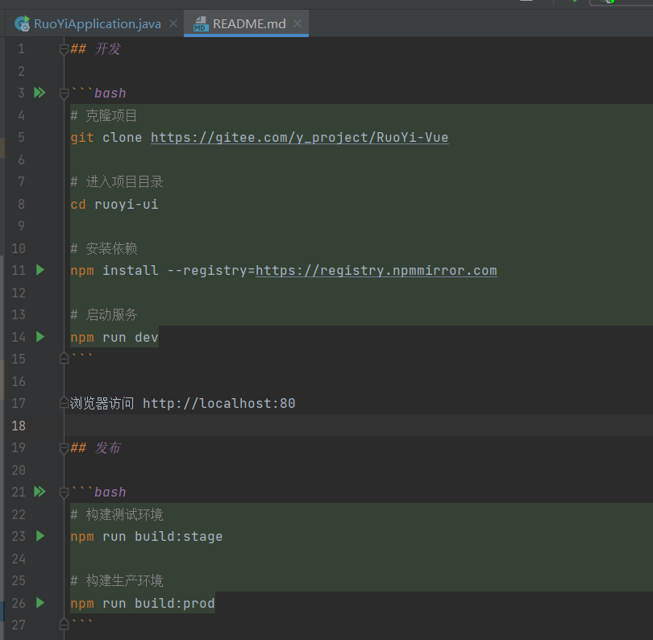
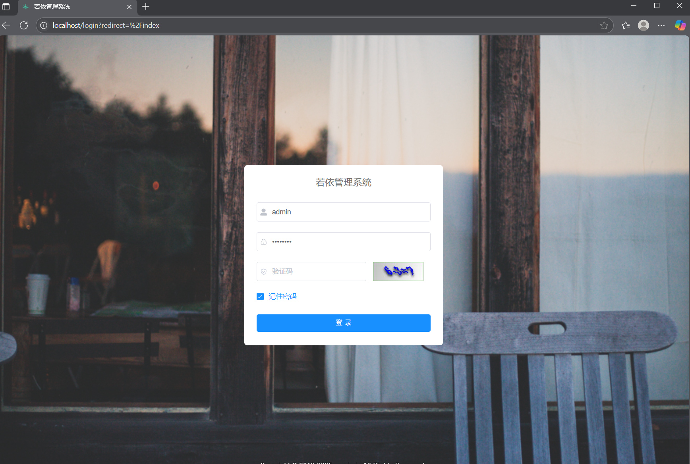

# 该文件夹中存放着整个若依项目，后续我们也会在此基础上进行二次创作，下面将呈现如何将这个项目配置到本地。

# **一、后端**

1、JDK：

JDK版本需要在1.8以上

2、MySQL：

计算机中先配置MySQL的环境，创建账号密码等之后在项目工程中寻找sql文件夹，这之中有数据库配置脚本，通过idea可一键配置。

之后在admin文件中resources下application-druid.yml填写数据库的账号和密码。

3、Redis：

计算机中需要部署好redis，之后像数据库一样修改账号密码即可，不需要进行其他操作。

文件地址是admin中resources下的application.yml

至此，后端的环境就配好了

在admin中运行RouYiapplication终端会呈现如下结果

# 二、前端

1、你的计算机上需要有node环境，配置好之后再rouyi-ui的readme文件中可以看到配置本项目需要用到的环境，运行它就好，

现在再启动这个项目就可以看到完整的界面了

